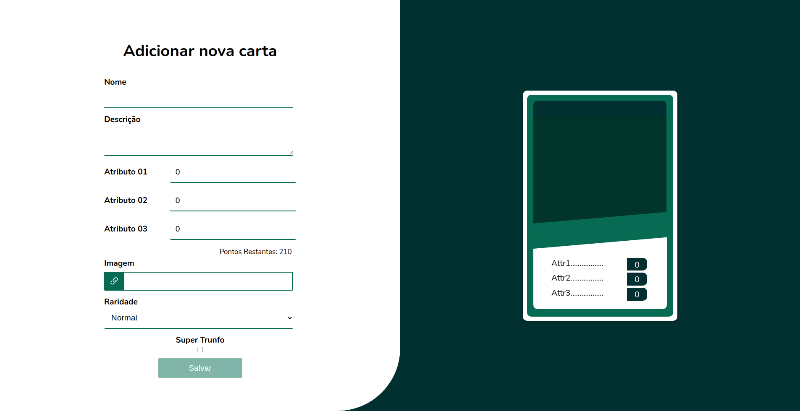
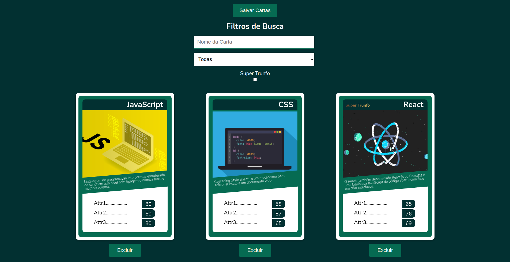

# React Tryunfo
 

 

 

This was the second React project developed during Trybe's Front-End module.

A digital version of Top Trumps written in react, in which you are able to create and save custom cards.
 

## Local setup and usage

* Clone this repo.
* Run `npm install`.
* Start the app with `npm start`.
